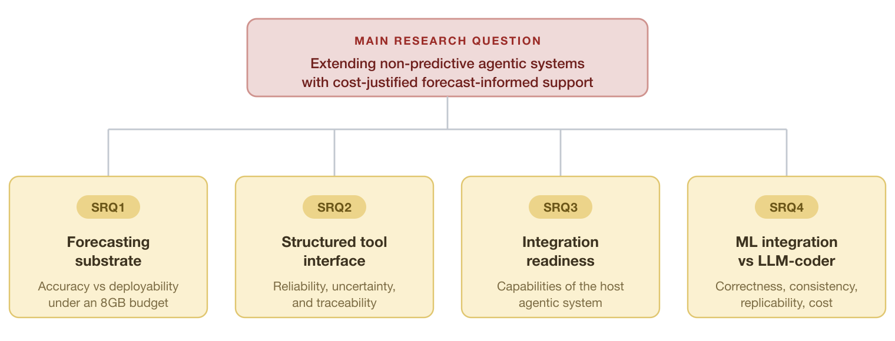
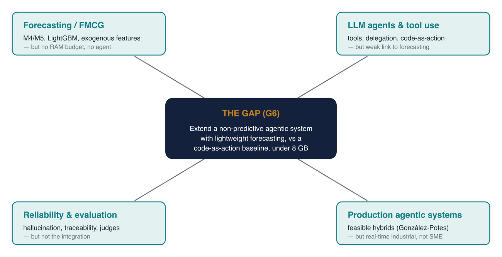

# Purpose of this document

This meeting covers **three chapters**: **Chapter 1 — Introduction**, **Chapter 2 — Literature Review**, **Chapter 3 — Methodology**. This document explains, as concise points, **what we did and how we set it up**, with a few figures, and leaves room to **record your feedback** (the *To discuss / Feedback* boxes).

---

# The thesis in one sentence

Extend a production **agentic** system that today is purely **descriptive** (it reports *what happened*) with a **lightweight forecasting substrate**, so that it can provide **forecast-informed** decisions that are reliable and cost-justified, **within a ~8 GB RAM budget**. The artefact has **three layers**: (1) a substrate of lightweight models → (2) a typed forecast-tool interface → (3) a bounded LLM agent. It is compared against a **code-as-action baseline** (an LLM that writes and executes its own forecasting code).

---

# Chapter 1 — Introduction

## What it argues

- The shift of BI systems from **descriptive** (dashboards, KPIs, historical trends) to **forecast-informed** (what will happen and what to do).
- Why **FMCG beverages** are a hard, representative test bed: volatility, promotions, seasonality, SKU proliferation; erratic and intermittent demand.
- The **constraint the literature ignores**: an SME cannot afford expensive GPUs; **~8 GB RAM** is the realistic budget, and it rules out transformers and locally hosted LLMs up front.
- The **real case**: Manifold AI / Prometheus, an agentic system in production but descriptive only → it is both the motivation and the empirical case.

## How it is structured (§1.1–§1.5)

- **§1.1 Background & Motivation** — the descriptive → forecast-informed transition, the FMCG case, the computational constraint, the gap in the agentic literature, the Danish context.
- **§1.2 Research Problem** — the **four problems** of the predictive extension: accuracy within budget; a typed interface (reliability, uncertainty, traceability); the production system's capability to integrate it; beating the code-as-action baseline.
- **§1.3 Research Questions** — Main RQ + SRQ1–4 (figure below).
- **§1.4 Delimitation** — scope boundaries (domain, 8 GB constraint, monthly batch, research prototype, generalisability).
- **§1.5 Thesis Structure** — the chapters mapped onto the DSR process.

## Key choices set here

- **Main RQ is "cost-justified"** and **SRQ4 baseline = code-as-action LLM** (the v4 reframe, aligned with Manifold).
- The **8 GB constraint** is treated as a **formal design criterion**, not a convenience.
- **Four** beverage categories (CSD, danskvand, energidrikke, RTD); **beer (totalbeer) excluded** because its facts are absent at source. **CSD** is the worked category.

## The Research Questions

{width=5.2in}

- **Main RQ** — How can non-predictive agentic systems be extended with lightweight forecasting to support reliable, forecast-informed and cost-justified decisions under computational constraints?
- **SRQ1** — Which lightweight models give the best accuracy / memory / category-specialisation trade-off?
- **SRQ2** — How to expose forecasts to the agent through a structured interface that preserves reliability, uncertainty and traceability?
- **SRQ3** — What capabilities does a production system need to integrate forecast support?
- **SRQ4** — Does a dedicated model improve correctness/consistency/replicability (at justified cost/latency) over a code-as-action LLM?

> **🗨 To discuss / Supervisor feedback (Ch. 1):**
>
> \
> \
> \

---

# Chapter 2 — Literature Review

## How we set it up

- It is a **narrative, integrative review**, not a systematic one: the contribution lies at the **intersection of several literatures**, so we make bodies of work that normally do not speak to each other speak, rather than answering a single effectiveness question with a rigid protocol.
- A **traceable but flexible method**: Google Scholar + NotebookLM + Zotero; ~100 records screened by title → ~40 read in full → **39 cited sources** (15 preprints, flagged as such).
- Throughout, a distinction is kept between what the **literature establishes** and what the **thesis designs / plans to evaluate / leaves to future work**.

## The eight thematic sections

- **§2.1 Forecasting as substrate (FMCG)** — M4/M5, LightGBM, exogenous features; no single model dominates (Ma 2025); **stability** as a production criterion alongside accuracy (Klee & Xia 2025).
- **§2.2 Lightweight ML under constraints** — efficiency as a binding constraint; Ng (2017) as a *precedent* on memory; clarified that **the binding constraint here is deployment cost, not data size** (after aggregation the data is small).
- **§2.3 From descriptive BI to forecast-informed** — "predict-then-optimize" (a forecast is valuable through its link to the decision; low error ≠ good decision); the distinction between **tight coupling** and our **loose, agent-mediated coupling**.
- **§2.4 LLM agents and tool use** — tool delegation can substitute for model scale (Toolformer); JSON function-calling (our choice) vs code-as-action (the baseline); Sapkota's taxonomy → the thesis is a **bounded tool-using agent**.
- **§2.5 Reliability, traceability, uncertainty, evaluation** — risks (hallucination, input noise, coordination failure); traceability as a requirement; uncertainty **calibration**; LLM-as-judge for SRQ4.
- **§2.6 Production-oriented agentic systems & integration readiness** — González-Potes (2026) as the closest exemplar; synthesis of the **required capabilities** (SRQ3).
- **§2.7 Research gap** — the missing intersection (figure below).
- **§2.8 Design Science Research** — why DSR is the right paradigm.

## The gap and the novelty

{width=5.6in}

- **Gap G6**: no study extends a **non-predictive, production-oriented agentic system** with lightweight forecasting, through a **loose, reliable, traceable interface**, and compares it against a **code-as-action baseline**, under **SME constraints**.
- **Novelty**: the intersection of (dedicated ML vs code-as-action) × (cost-aware FMCG) × (extension of a production agentic system) appears in no paper in the corpus.

> **🗨 To discuss / Supervisor feedback (Ch. 2):**
>
> \
> \
> \

---

# Chapter 3 — Methodology

## Philosophy of science (§3.1)

- **Pragmatism**: knowledge is judged by its practical consequences ("knowledge is what works") → well-suited to artefact-oriented research.
- **Modest realism** about the data: demand and sales exist, but are known only through the Nielsen instrument with its assumptions → this motivates the data quality assessment and a *context-bounded* interpretation.

## Research design: DSR (§3.2)

- **Design Science Research** (Hevner 2004): build a working artefact **+** generate transferable *design knowledge*.
- **Three cycles**: relevance (Manifold's need) · design (Ch. 5–8) · rigor (Ch. 2 literature).
- **Six activities** of Peffers (2007) mapped onto chapters; CBS design type = **explanatory**; declared status of a **research prototype**, not a production-ready system.

## Research strategy (§3.3)

- **Quantitative quasi-experiment + single-case embedded study**: the experiment provides the controlled evaluations (SRQ1, SRQ4); the case (Manifold/Prometheus) anchors the findings in real data.
- **Unit of analysis**: the artefact, evaluated across the categories at **brand × retailer → month** granularity; the **DVH EXCL. HD** scope is locked (aligned with Manifold).

## Approach per sub-question (§3.5)

- **SRQ1** — 5 models (ARIMA, Prophet, LightGBM, XGBoost, Ridge), Optuna-tuned; metrics MAPE/WMAPE + RAM/runtime + stability; specialised vs pooled; RAM profiled in **RSS**.
- **SRQ2** — **JSON function-calling** interface with strict schemas; forecast + interval (calibration); reliability via validation, traceability via mapping; lightweight Python coordinator (LangGraph = production target).
- **SRQ3** — a **capability-readiness** assessment of the four capabilities against the real Prometheus (not a live integration).
- **SRQ4** — ~50 shared prompts, **dedicated model vs code-as-action** (E2B sandbox); correctness/consistency/replicability (primary) + cost/latency (secondary); LLM-as-judge + human subset; **pilot scale**.

## Validity and limitations (§3.6–§3.7)

- **Internal validity**: the same split across all models, fixed seeds, a single manipulation in SRQ4.
- **External validity** is explicitly limited (Danish market, 8 GB, monthly batch).
- **Limitations**: data confidentiality (reproducibility limited to features/code/protocol); sample size near the limits; SRQ4 at pilot scale; sequential model execution (due to the 8 GB constraint).

> **🗨 To discuss / Supervisor feedback (Ch. 3):**
>
> \
> \
> \

---

# Open questions for the supervisor

- **DSR acceptance (OI-03)**: is DSR accepted as the methodology for a Business Administration + Data Science thesis at CBS?
- **Page limit**: 80 (solo) vs 120 (group) standard pages — to confirm.
- **Preprints**: is it acceptable to cite preprints where they are the closest available precedent (they are flagged as such)?
- **Four vs five categories**: beer excluded because its facts are missing at source — is this acceptable?
- **Calibration**: present it as a result (conformal already implemented, CSD coverage 90.5%) rather than as future work.
- **Novelty / gap (G6)**: is it convincing as the primary contribution?

> **🗨 General notes / agreed next steps:**
>
> \
> \
> \

---

*Brief status (context, not for discussion today): Ch. 1–5 are in review-ready draft; SRQ1 results are in; the SRQ4 code-as-action run is the main remaining work and unblocks Ch. 7–10.*
