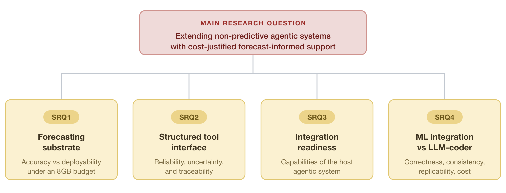

<!-- PROSE STRIPPED 2026-09-01 (P0044).
     Authoritative prose lives in the OneDrive .docx; the read-only mirror is
     docx-exported-snapshots/2026-09-01_18-50/chapters.
     This file is a PLANNING surface: bullets, structure, status and provenance.
     Do not paste prose back in -- two live copies is the drift this removes.
     Full pre-strip prose: .archive/2026-09-01_superseded-prose/sections-drafts-prose/ -->

# Chapter 1 — Introduction
> Status: PROSE DRAFT — written 2026-04-05; realigned 2026-06-16 to the rescoped framing (forecast-informed agentic decision-support; RQs v3) with §1.1 reframed and reference list reconciled
> Author: Claude Code — requires human review before finalisation
> Word count target: ~8 standard CBS pages (2,275 chars/page)

---

## 1.1 Background and Motivation

---

## 1.2 Research Problem

---

## 1.3 Research Questions

> **Main RQ**: *How can production-oriented agentic decision-support systems without native predictive capabilities be extended with lightweight forecasting models to support reliable, forecast-informed, and cost-justified decision-making under computational and deployment constraints?*

{width=6in}

---

## 1.4 Delimitation

---

## 1.5 Thesis Structure

---

## References cited in this chapter

- González-Potes, A., et al. (2026). Hybrid AI and LLM-enabled agent-based real-time decision support architecture for industrial batch processes. *AI*, *7*(2), 51.
- Hevner, A. R., March, S. T., Park, J., & Ram, S. (2004). Design science in information systems research. *MIS Quarterly*, *28*(1), 75–105.
- Liu, S., Guo, B., Yu, Z., et al. (2025). On accelerating edge AI: Optimizing resource-constrained environments. *arXiv preprint arXiv:2501.15014*. [PREPRINT — not peer-reviewed]
- Sapkota, R., Roumeliotis, K. I., & Karkee, M. (2026). AI agents vs. agentic AI: A conceptual taxonomy, applications and challenges. *Information Fusion*, *126*, Article 103599. https://doi.org/10.1016/j.inffus.2025.103599
- Semerikov, S. O., Vakaliuk, T. A., Kanevska, O. B., Ostroushko, O. A., & Kolhatin, A. O. (2025). Edge intelligence unleashed: A survey on deploying large language models in resource-constrained environments. *Journal of Edge Computing*, *4*(2). https://doi.org/10.55056/jec.1000
- Klee, S., & Xia, Y. (2025). Measuring time series forecast stability for demand planning. *KDD '25 Workshop on AI for Supply Chain*.
- Ma, B. J., Jackson, I., Huang, M., Villegas, S., & Macias-Aguayo, J. (2025). A data-driven and context-aware approach for demand forecasting in the beverage industry. *International Journal of Logistics Research and Applications*.
- Makridakis, S., Spiliotis, E., & Assimakopoulos, V. (2020). The M4 competition: 100,000 time series and 61 forecasting methods. *International Journal of Forecasting*, *36*(1), 54–74.
- Makridakis, S., Spiliotis, E., & Assimakopoulos, V. (2022). M5 accuracy competition: Results, findings, and conclusions. *International Journal of Forecasting*, *38*(4), 1346–1364.
- Ng, S. (2017). Opportunities and challenges: Lessons from analyzing terabytes of scanner data. *NBER Working Paper*, *23673*.
- Peffers, K., Tuunanen, T., Rothenberger, M. A., & Chatterjee, S. (2007). A design science research methodology for information systems research. *Journal of Management Information Systems*, *24*(3), 45–77.
- Rinaldi, G., Giordano, F., De Stefano, C., & Fontanella, F. (2025). DSS4EX: A decision support system framework to explore artificial intelligence pipelines with an application in time series forecasting. *Expert Systems With Applications*, *269*, 126421.

---

## OPEN REWRITE NOTES (P0044, 2026-09-01) — act on these before prose

Source: Word comments [15]-[22], [25], [26], [30] on the 2026-09-01 snapshot,
plus measurements in `plans/P0044_.../findings.md`.

### 1. RAM: re-anchor on the MEASURED 4 GB, not the assumed 8 GB  (F22, F23)

- Manifold's production Prometheus E2B template `fxe7gzkqjupdhbx4uvpr` is
  provisioned at **4096 MB**, verified live against the E2B API.
- The **8 GB** figure is this project's own assumption. Ng (2017) is cited in
  support, but Ng argues that *memory is the binding design variable* at
  terabyte scale -- Ng does not state an 8 GB SME budget. The number is
  unsourced.
- So the contrast is an **unsourced assumption vs. a measured production
  value**. Prefer the measured one.
- Every result holds a fortiori under the tighter bound: serving 36.8 MB,
  refit ~37 MB, ~1% of 4 GB.
- **Delete** the GPU-instance / locally-hosted-LLM cost passage (comment [20]):
  Manifold hosts no LLM. The 4 GB is sandbox budget for code execution and
  conversation. The `[CITATION TO ADD: cloud-instance pricing source]` placeholder
  goes with it.
- Reframe RAM from promise to **result**: not "we operate under a hard
  constraint" but "serving a trained model fits in a measured 4 GB production
  sandbox, which is what makes the design deployable".

### 2. Drop the exogenous-enrichment premise  (comments [15] [16] [17]; F7)

- VERIFIED unsupported. Live features are lags, rolling mean/std, month,
  quarter, peak_month, promo_intensity, zero_run_*, log_sales_units -- all
  endogenous or calendar-derived. Every holiday-calendar hit is in `.archive/`.
- **Narrow, do not delete**: `promo_intensity` IS exogenous (promotion is a
  decision external to the demand series), as is distribution coverage. Claim
  promotional + calendar signals; drop any implication of weather, macro or
  holiday-calendar enrichment.
- The M4/M5 "explanatory variables are the open frontier" quote can stay only if
  the thesis stops claiming to take up that direction wholesale.

### 3. Promote the serving-approach contribution  (comment [22])

Currently under-elaborated, and it is what SRQ4 actually measures: what a
multi-indicator ML serving approach buys in prediction quality, cost and latency.
The harness logs all three per run. This should share billing with the RAM
framing, not sit beneath it.

### 4. Do NOT "fix" these -- they are already implemented  (F8)

- [25] memory efficiency IS tracked (`srq1_profiling.py`,
  `train_and_persist.py:214-244`). The instrument was wrong, not absent; fixed.
- [26] observability/traceability IS implemented -- every SRQ4 run logs
  latency, tokens, cost and a tool trace. What is missing is an *evaluation*
  of it. If Ch1 promises observability as a **measured** property, that is the
  real gap; as an **implemented** property it is satisfied.

### 5. On-demand retraining: state as measured, with the cost caveat  (F19-F21, F24)

- Refit on stored hyperparameters: ~3 s, ~37 MB. Re-tuning costs **12x**
  (measured: 84.4 s vs 7.0 s across 5 cutoffs, 30 trials each).
- The ~100x figure for a 200-trial budget is an **extrapolation**, not a
  measurement. Label it as such.
- **Do NOT claim re-tuning is less accurate** -- retracted (F21). Varying only
  the Optuna seed on identical data moves test wMAPE by 3.97pp, which swamps the
  0.28pp between arms.
- Defensible claim: refit is chosen on **cost**, being indistinguishable in
  accuracy at this data scale.
- Report the one-month (95-row) validation window as a limitation.

### 6. Smaller items

- [21] Ng (2017) "four terabytes" is unverified. Cheapest fix: cut the figure,
  keep the citation for the memory-as-design-variable argument.
- [27] SRQ4's wording is very long. Content is sound; consider splitting the
  production-system clause into a following sentence.
- [30] heterogeneous-category generalisation IS verifiable -- P0042 block 3
  (9 brands, 3 categories, C_model) exists to test exactly this.
- [31] the promo-coverage asymmetry teases EDA results; keep the hint but add a
  forward pointer to the chapter that treats it properly.
- [28] repository sharing: submission-time task. Needs a clean repo with no
  CLAUDE artefacts, no Nielsen data, no credentials.
